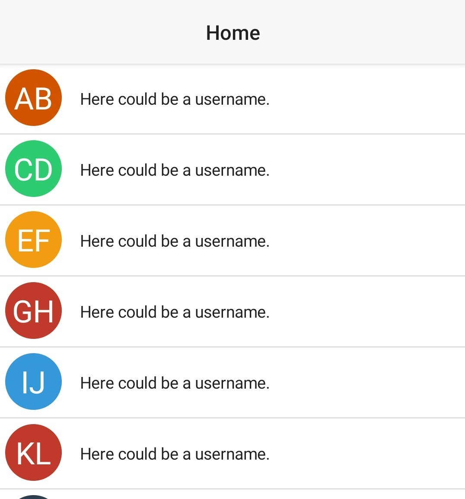

# nativescript-letter-avatar

[](https://travis-ci.org/hrueger/nativescript-letter-avatar) [](https://github.com/hrueger/nativescript-letter-avatar/blob/master/LICENSE) [](https://github.com/hrueger/nativescript-letter-avatar/graphs/commit-activity) [](https://github.com/hrueger/nativescript-letter-avatar/) [](https://greenkeeper.io/)

With this plugin you can create beautiful looking letter avatars in your nativescript app!

<table>
<tr>
<td>

## How it looks like


</td>
<td>

## Installation

Install the plugin from using `tns plugin add nativescript-letter-avatar`.


</td>
</tr>
</table>

## Usage 
### NativeScript Core:
Define the namespace
```xml
<Page class="page"
    loaded="pageLoaded"
    navigatingTo="onNavigatingTo" 
    xmlns="http://schemas.nativescript.org/tns.xsd"
    xmlns:ns="nativescript-letter-avatar">
```
Use the plugin:
```xml
<ns:LetterAvatar id="myAvatar" text="AB"></ns:LetterAvatar>
```

You can also add custom styles:
```html
<ns:LetterAvatar color="blue" padding="5" borderRadius="7" id="myAvatar" text="AB"></ns:LetterAvatar> 
```

> Unfortunately, CSS properties are not supported.

For more info and examples check out the demo folder.

### Angular Version:

In your `app.module.ts` include the library like so:
```typescript
import { LetterAvatarModule } from "nativescript-letter-avatar/angular";
```
and add it to the imports array:
```typescript
@NgModule({
    bootstrap:  [
        ...
    ],
    declarations: [
        ...
    ],
    imports: [
        ...
        LetterAvatarModule, // <--- add this here
    ],
    schemas: [
        ...
    ],
})
export class AppModule { }
```

The use it in your .html file:
```html
<LetterAvatar text="AB"></LetterAvatar>
```

You can add custom styles:
```html
<LetterAvatar color="blue" padding="5" borderRadius="7" text="AB"></LetterAvatar>
```

> Unfortunately, CSS properties are not supported.

For more info and examples check out the [demo](./demo) and the [demo-angular](./demo-angular) folder.


## License

MIT
